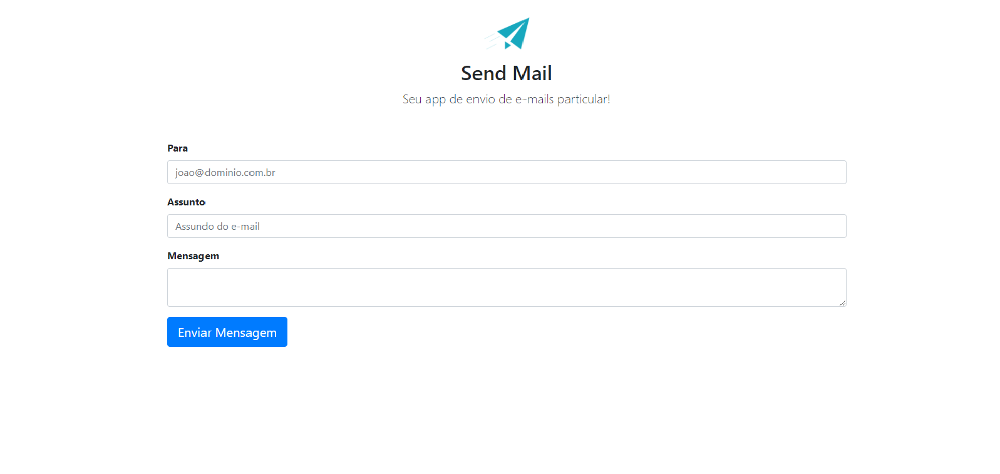
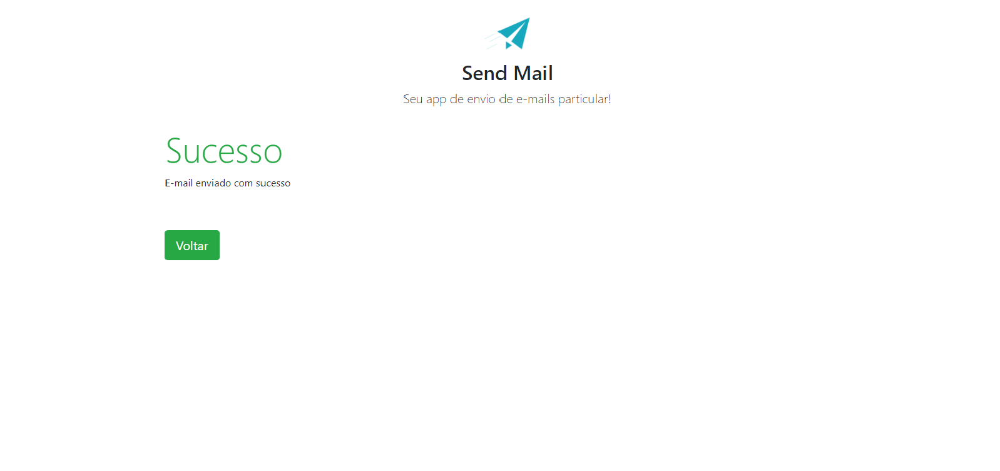

# Projeto-SendMail
Um projeto para praticar PHP, que possibilita enviar e-mail com a biblioteca PHPMailer.

## Layout web



## Tecnologias utilizadas
<p>Linguagens e padrões que foram utilizados para desenvolver o app</p>

## Front-end
- HTML
- CSS

## Back-end
- PHP

### Competências 
- Utilização da biblioteca PHPMailer

## Back-end
Pré-requisitos: Servidor Apache (XAMPP)

Clonar repositório

```bash
  https://github.com/othonss/Projeto-SendMail
```
Copiar para dentro da pasta htdocs (caso XAMPP)

## Front-end
Pré-requisitos: Navegador  

Acessar o localhost indicando o diretório aonde foi copiado 

Exemplo: 
```bash
  http://localhost/app_send_mail/index.php
```
## Autor 

Othon Santos da Silva

<a href="https://www.linkedin.com/in/othon-santos-35531b129/" target="_blank">
    
 </a>
